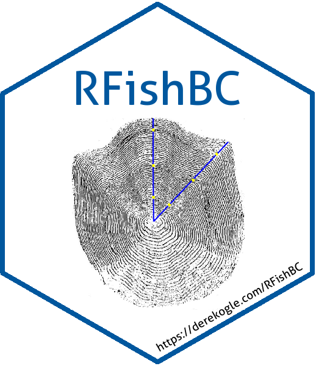

[](http://www.repostatus.org/#wip)
[](https://doi.org/10.5281/zenodo.1218245)
[](http://www.r-pkg.org/pkg/RFishBC)
[](https://ci.appveyor.com/project/droglenc/RFishBC)
[](https://travis-ci.org/droglenc/RFishBC)
[](https://coveralls.io/r/droglenc/RFishBC?branch=master)


RFishBC 
===

The **RFishBC** package helps fisheries scientists collect growth data from calcified structures and back-calculate estimated lengths at previous ages. The package is intended to replace much of the functionality provided by the now out-date fishBC software.

## Installation

The most recent development version (on GitHub) of **RFishBC** may be installed by running the two lines below in your R console.

```r
if (!require('devtools')) install.packages('devtools'); require('devtools')
devtools::install_github('droglenc/RFishBC')
```

You may need to have R Tools installed on your system to use the two lines above. See the instructions for ([R Tools for Windows](https://cran.r-project.org/bin/windows/Rtools/) or [R Tools for Mac OS X](https://cran.r-project.org/bin/macosx/tools/)).


