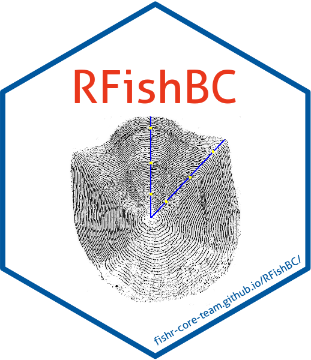

[](https://www.repostatus.org/#active)
[](https://doi.org/10.5281/zenodo.10426347)
[](http://www.r-pkg.org/pkg/RFishBC)
[](http://www.gnu.org/licenses/gpl-3.0.html)
[](https://github.com/fishr-core-team/RFishBC/actions)
[](https://codecov.io/gh/fishr-core-team/RFishBC?branch=master)
[
](http://www.r-pkg.org/pkg/RFishBC)
[](http://www.rdocumentation.org/packages/RFishBC)


## RFishBC 

The **RFishBC** package helps fisheries scientists collect measurements from calcified structures and back-calculate estimated lengths at previous ages. **RFishBC** is intended to replace much of the functionality provided by the now out-date fishBC software.

### Use

General desriptions for using **RFishBC** are under the *Vignettes* tab at the top of [this page](https://fishr-core-team.github.io/RFishBC/). I suggest at least quickly reading each vignette to get an overall feel for **RFishBC** and then following the workflow suggestions in the last vignette. Detailed descriptions for each function are under the *Reference* tab at the top of [that page](https://fishr-core-team.github.io/RFishBC/).

### Installation

The [most recent stable version (on CRAN)](https://cloud.r-project.org/package=RFishBC) of **RFishBC** may be installed with

```r
install.packages("RFishBC")
```

The most recent development version may be installed from GitHub with

```r
if (!require('remotes')) install.packages('remotes'); require('remotes')
remotes::install_github('fishr-core-team/RFishBC',ref="dev")
```

You may need to have R Tools installed on your system to use the two lines above. See the instructions for ([R Tools for Windows](https://cran.r-project.org/bin/windows/Rtools/) or [R Tools for Mac OS X](https://cran.r-project.org/bin/macosx/tools/)). Additionally, you may need the X11 graphics functionality if using Mac OS.

### Questions / Comments / Problems or Contributions
Report questions, comments, or bug reports on the [issues page](https://github.com/fishR-Core-Team/RFishBC/issues).

We are always looking for others to contribute to **RFishBC**. Please feel free to make a pull request via GitHub or to contact the maintainers.

Please adhere to the [Code of Conduct](https://fishr-core-team.github.io/RFishBC/CODE_OF_CONDUCT.html).

