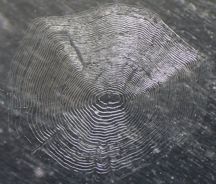

```{r setup, include = FALSE}
knitr::opts_chunk$set(
  collapse = TRUE,
  comment = "#>"
)
```


# Introduction
The size of fish at a previous time in their life is often estimated through "back-calculation." [Back-calculation](BCIntro.html) of previous lengths requires accurate measurements of annual growth on calcified structures from individual fish and a suitable model that relates growth on the structure to growth of the fish.

The [FishBC software](https://fisheries.org/bookstore/all-titles/software/70317/) is commonly used to measure lengths on a calcified structure and apply a back-calculation model to estimate length at previous ages. However, FishBC only works on out-dated computers, there are no plans to update it, and it is not open source. The functionality in the `RFishBC` package is meant to replace FishBC. Methods for making measurements on images of calcified structures is demonstrated in this vignette. Using those measurements to back-calculate fish length at a previous age is demonstrated in the [Compute Back-Calculated Lengths](BCCalc.html) vignette.

\  

\  

----

# Vignette Assumptions

### Understand Back-Calculation
This vignette assumes that you have a basic understanding of how to back-calculate fish lengths at previous ages as described in the [Short Introduction to Back-Calculation](BCIntro.html) vignette. At the very least, you should be aware of what calcified structures and radial measurements are.

### Static Structure Images
This vignette also assumes that you have static digital images of structures. The images must be of jpeg (.jpg), portable network graphics (.png), bitmap (.bmp), or TIFF format. Images will usually be obtained from a camera mounted on a microscope and connected to a computer. Below is an image of a Kiyi (*Coregonus kiyi*) scale.



\  

Ideally, but not necessarily, the image will also contain an object of known length (e.g., a "scale-bar") so that actual lengths on the structure can be found. If a scale-bar is absent, then the measured lengths will be on an arbitrary scale (i.e., the actual values will be meaningless but the proportion of the total structure radius to each annulus will be meaningful). An image of a Kiyi otolith with a 1-mm scale-bar is shown in later sections of this vignette.

The process described herein requires that all images to be processed be in the same directory or folder. To be most efficient (and simple), this directory should contain ONLY image files related to a particular project (e.g., one species for one water body for one year) and all image files should be of the same type (e.g., png or jpg). Additionally, as shown in the [Processing Multiple Images](#multipleimages) section below, it may be more efficient if the image file names end with an underscore (i.e., a "_") followed by the fish's unique identification number (and then, of course, the file extension).

The working directory of R should be set with `setwd()` to the directory that contains the images. The following is an example of setting a working directory in R.

```{r eval=FALSE}
setwd("c:/work/aging/Kiyi2014")
```

The working directory may also be set interactively through a dialog box using the following code.[^RStudioSETWD]
```{r eval=FALSE}
setwd(choose.dir())
```

Finally, note that the process described herein will produce one R data object file (.rds files; hereafter called "R data file") for each set of measurements made on a structure image. These R data files will be saved in the current working directory (likely the directory with the structure image files). I suggest keeping the R data files and corresponding structure image files together at all times, as the R data files serve as archives of the data collected from the structure image files.

### R Packages
The methods described in this vignette require the following packages.

```{r message=FALSE}
library(RFishBC)
library(dplyr)    # for mutate(), inner_join(), %>%
```

\  

\  

----

# Measure Radii {#measurereadii}
The `digitizeRadii()` function is used to

1. Load a structure image.
1. Optionally provide a scale for the image.
1. Optionally interactively select the structure focus and margin (to form a linear transect on which annuli will be marked).
1. Interactively select annuli on the structure image.
1. Create an R data file that contains the radial measurements to selected annuli and other information about the structure and the data extraction process.

For example (*but described more thoroughly further below*), the line below identifies "Scale_1.jpg" as the structure image, this fish has an identification number of "1", this reading of the image should be labelled as "DHO",[^readingex] and the structure margin or edge should not be considered as an annulus. When this line is run it will open the image,[^inwd] allow the user to select points that represent a linear transect and annuli on that transect, and save information about this image and results of this process to "Scale_1_DHO.rds".[^saveex1]

```{r eval=FALSE}
digitizeRadii("Scale_1.jpg",id="1",reading="DHO",edgeIsAnnulus=FALSE)
```

Further specifics of `digitizeRadii()` and many of its arguments[^DRargs] are described below.

### Basics
The `digitizeRadii()` function **requires** only three arguments.

* `img`: File name (or names; see the [Processing Multiple Images](#multipleimages) section) for the structure image (or images), which must be in the current working directory. A dialog box will be provided from which the image file (or files) can be selected if this argument is not given and you are using a Windows machine.
* `id=`: The unique identifier (or identifiers if more than one image is provided in `img`) for the fish/structure(s). If this argument is missing, then the ID can be entered in a dialog box (if using Windows) or in the console. By default, the Windows dialog will be populated with the fish ID if that ID follows an underscore at the end of the filename (sans the extension).
* `edgeIsAnnulus=`: A logical that indicates whether the point selected at the structure margin should be considered an annulus or not. If the fish was captured at a time when the margin shows growth, but not a complete year's worth of growth, then use `edgeIsAnnulus=FALSE`. However, if the fish was captured before the current year's growth commenced or after it has completed then use `edgeIsAnnulus=TRUE`. **Identifying whether the structure margin is an annulus or not is critical to properly recording radial measurements.** As such, there is no default for this argument (i.e., it **MUST** be set by the user).

Other **optional** arguments that are likely to be commonly used are:

* `reading=`: Label for the reading. The `reading=` argument is primarily used when the structure is read more than once. However, I suggest giving a descriptive label to `reading=` even if there are no plans to read the structure again.[^description]
* `windowSize=`: A value that sets the size of the separate window in which the image will appear. This value will become the larger of the two dimensions, with the other value proportionate so that the original aspect ratio of the image is maintained. Note that the default is `windowSize=7`; so values larger than 7 represent a "zooming in."
* `device=`: The image will be opened in a separate window. This will happen seamlessly with many operating systems (especially if using a Windows machine). However, `device="X11"` may be needed with some Mac OS.[^X11]

Finally, note that the R data file that will be created after the annuli have been selected will have the same name as the image file[^excludeextension] but including the suffix optionally provided in `suffix=`. If nothing is given in `suffix=`, then a suffix will be created from `reading=` (if it exists). For example, if the structure image file was named "Scale_1.jpg", then the resultant R data file will be named "Scale_1_DHO.rds" if `reading="DHO"` and `suffix=` was not set or "Scale_1_TESTING.rds" if `reading="DHO"` and `suffix="TESTING"`.

By default, the fish ID will be shown in the top-left corner of the image. This may be moved by giving a different location to `pos.info=`. For example, `pos.info="bottomright"` would move this information to the bottom-right corner of the image. The color of this information may be changed with `col.info=` and the relative size may be changed with `cex.info=`.

At this point, the image may look something like that below.


\  

Other arguments to `digitizeRadii()` are described in the specific sections below.

### Setting the Scale
A scaling factor to convert measurements on the image to actual measurements on the structure is required if actual lengths, rather than arbitrary (but proportional) lengths, are needed.[^actuallength] This scaling factor may be calculated from a scale-bar found on the image or provided by the user.

**Scale-bar On Image:** If a scale-bar of known length exists on the image, then use `scaleBar=TRUE` with the actual length of the scale bar given in `scaleBarLength=`. You will then select the two end points of the scale-bar on the structure image prior to selecting points that represent annuli. Press the 'f' key (for "finished") after selecting the end points of the scale-bar.[^deletekey] An appropriate scaling factor will be computed from your selections and the radial measurements on the image will be converted to actual lengths on the structure.

**Separately Defined Scaling Factor:** In applications where a scale-bar does not exist on the image, the user can provide a value to `scalingFactor=`, which will be multiplied by lengths on the structure image to derive actual lengths. One way to derive this scaling factor is to capture an image of the structure at a specific magnification on the microscope and then capture a separate image of an object of known length at that same magnification. Note that these captured images must be of the same size so that the aspect ratio is consistent. A scaling factor may then be computed from the image with the object of known length and applied to the structure image. This scaling factor can be found by giving `findScalingFactor()` the file name with the object of known length and that known length in `knownLength=`. The value returned from `findScalingFactor()` can then be given to `scalingFactor=` in `digitizeRadii()`.[^sforder]

If no `scalingFactor=` is derived from a scale-bar or provided, then the radial measurements returned by `digitizeRadii()` are simply proportional to the unknown actual lengths on the structure.

At this point (i.e., after having selected the scale-bar endpoints), the image may look something like that below.


\  

### Selecting a Transect
After the scaling factor has been determined (or provided) and if `makeTransect=TRUE` (the default), then you will select a transect on the structure image on which annular marks will be selected. This transect is selected by **first selecting the structure focus** and **then selecting the structure margin/edge** and pressing the 'f' key.[^deletekey] The color of the transect may be changed with `col.transect=`. The width of the transect may be increased by including a number greater than 1 in `lwd.transect=`.

At this point (i.e., after having selected the transect endpoints), the image may look something like that below.


\  

### Selecting Annuli
Once a transect has been identified on the structure (assuming that you are using a transect), then you can select points on the structure that represent annuli. Points are selected by clicking with the first (left) mouse button at a point on the image. The most recently selected point can be removed by pressing the 'd' key (for "delete"). When the last point has been selected, press the 'f' (for "finished") key.

Selected points will be marked with the plotting character given in `pch.sel=` (defaults to a filled circle) with a color given in `col.sel=` (defaults to yellow). Any deleted points will be marked with the color and character in `col.del=` and `pch.del=` (defaults to a red circle with an "x" in it).

If using a linear transect, many users prefer that all selected points fall exactly on the transect. In practice, some points may be selected that are slightly off the transect. Selected points will be "moved" perpendicularly to fall exactly on the transect when `snap2Transect=TRUE` (the default).

At this point, the image may look something like that below (*note that two points were deleted in the selection process for this image*).


\  

When you have finished selecting points, information about your selections, including the calculated radial measurements, are saved to the R data file. The contents of this file are described further [here](http://derekogle.com/RFishBC/reference/digitizeRadii.html#value).

\  

### Processing Multiple Images {#multipleimages}
It will be common to process a number of image files, one after another. The selection of the images can be made more efficient by supplying `digitizeRadii()` a vector of image file names and corresponding fish IDs. These vectors can be constructed in a variety of ways before calling `digitizeRadii()`. First, the user can simply type the image names and fish IDs into vectors; e.g.,
```{r eval=FALSE}
imgs <- c("Scale_1.jpg","Scale_2.jpg","Scale_3.jpg")
ids <- c("1","2","3")
```

However, if the image file names follow a general pattern, for example always being JPG files and always containing the word "Scale" or "Bass" or something similar, then a list of all image file names in the current working directory can be obtained with `listFiles()`. This function takes the common extension as its first argument and the common "other" words in `other=`. For example, the following code finds all JPG files that also contain the word "Scale" in the current working directory.
```{r}
( imgs <- listFiles("jpg",other="Scale"))
```

The user would still need to manually create a vector of corresponding fish IDs. However, if the image file names follow the idiom of having the fish ID after an underscore (i.e., "_") at the end of the file name (not including the extension) then `getID()` can be used to efficiently extract a vector of fish IDs from the vector of file names. For example, 
```{r}
( ids <- getID(imgs) )
```

With these vectors, the following call to `digitizeRadii()` will bring up the first image on which you can mark annuli as described above. When you have finished with the first image then the second image will automatically appear on which you can then mark annuli. This process will be repeated until the last image in the vector of images has been completed.
```{r eval=FALSE}
digitizeRadii(imgs,id=ids,reading="DHO",edgeIsAnnulus=FALSE)
```

Some directories may have such a large number of images that the user will not want to process them all at one time as the code above would do. In this case, the user could select a certain number, say 10, of the images to process at any one time. For example, the call to `digitizeRadii()` below would be used to process the first 10 images from the vector of image names.
```{r eval=FALSE}
digitizeRadii(imgs[1:10],id=ids[1:10],reading="DHO",edgeIsAnnulus=FALSE)
```

The second 10 images could then be processed with the following.
```{r eval=FALSE}
digitizeRadii(imgs[11:20],id=ids[11:20],reading="DHO",edgeIsAnnulus=FALSE)
```

If one does not include an image file name (or vector of image file names) in `digitizeRadii()` then a dialog box will appear in which a file name or names can be selected. If multiple file names are selected then `digitizeRadii()` will assume that the file names use the convention of having the fish ID after the last underscore. In this way, multiple files can be chosen from a dialog box, rather than by creating the vectors described above. In this case, the call to `digitizeRadii()` would look like the following.
```{r eval=FALSE}
digitizeRadii(reading="DHO",edgeIsAnnulus=FALSE)
```

Note that when processing multiple image files as described in this section, **all of the options must be the same across all of the images**. In the example above, for example, all image files must use `reading="DHO"` and `edgeIsAnnulus=FALSE`.

\  

### Starting Over or Skipping an Image {#restartabort}

The user can "start over" the processing of any image by pressing the "z" key at any time during the processing. Note however that this is a "hard reset" in the sense that all points selected prior to pressing the "z" key will be lost, the original unmarked image will be reloaded, and you will need to start over processing the image (i.e., marking the scale-bar, transect, and annuli again).

The user may also abort or skip processing an image that has been loaded by pressing the "q" key at any time during the processing. This will most likely be useful when processing multiple images at one time as described previously. For example, an image may appear that is unreadable such that annuli cannot be reliably marked on the image. Note that aborting processing an image will result in no R data file being created for that image.

\  

\  

----

# Setting Argument Defaults for a Session {#setoptions1}

As described above, `digitizeRadii()` has several arguments that provide flexibility when measuring radii on images. The default values for all of these arguments can be seen with `RFBCoptions()` (i.e., without any arguments). The value for any argument can be seen by appending the argument name to `RFBCoptions()` with a `$`. For example, the current setting for the `makeTransect` argument is `TRUE` as shown below.
```{r}
RFBCoptions()$makeTransect
```

Default values for these arguments may be changed within `digitizeRadii()`. For example, the code below sets the "reading" label to "DHO", the edge to not be considered an annulus, the width of the transect line to be thicker, and identifying that a scale-bar with a known length of 0.6 mm is present.
```{r eval=FALSE}
digitizeRadii("Scale_1.jpg",id="1",reading="DHO",edgeIsAnnulus=FALSE,
              lwd.transect=3,scaleBar=TRUE,scaleBarLength=0.6)
```

However, changing the arguments within `digitizeRadii()` is inefficient if you will be processing many images with the same arguments. Thus, the default values for these arguments can be set for the entire session (i.e., until you change them or close R and open it again) by including the argument name set equal to the desired default value within `RFBCoptions()`. For example, if the code below is run at the beginning of a session (i.e., early in the script), then every call to `digitizeRadii()` after that will default to using "DHO" as the reading label, not treating the edge as an annulus, using a thicker line for the transect, and identifying that a scale-bar with a known length of 0.6 exists on the image.
```{r eval=FALSE}
RFBCoptions(reading="DHO",edgeIsAnnulus=FALSE,lwd.transect=3,
            scaleBar=TRUE,scaleBarLength=0.6)
```

With these changes to the default settings, the last call to `digitizeRadii()` above could be simplified as shown below.
```{r eval=FALSE}
digitizeRadii("Scale_1.jpg",id="1")
```

Argument values can still be changed from the default values for a particular call to `digitizeRadii()` by including that argument in the specific call. For example if the edge was an annulus for the structure on only one of the images, then include `edgeIsAnnulus=TRUE` in `digitizeRadii()`.

\  

\  

----

# Data from One Structure

The radial measurements recorded from one structure may be seen by submitting the R data file name to `combineData()`.[^combinedatawd] By default the radial measurement that includes the "plus-growth" will be omitted (as this radial measurement is equal to the radial measurement at capture and is thus redundant with the value in the `radcap` column).[^deletePlusGrowthRad]

```{r}
combineData("Scale_1_DHO.rds")
```

By default the data are shown in "long" format where each row consists of one radial measurement with all radial measurements for an individual fish distributed across several rows. The radial data can be shown in "wide" format where each row consists of all the radial measurements (in separate columns) for an individual fish by including `formatOut="wide"`.

```{r}
combineData("Scale_1_DHO.rds",formatOut="wide")
```

\  

\  

----

# Combine Data from Multiple Structures {#multiplestructures}
Of course, most analyses will consist of collecting radial measurements from structures from many fish. For example, suppose that "Scale_1.jpg" and "Scale_2.jpg" were both read by "DHO" using the following code. Following this, "Scale_1_DHO.rds" and "Scale_2_DHO.rds" would both exist in the current working directory.

```{r eval=FALSE}
RFBCoptions(reading="DHO",edgeIsAnnulus=FALSE)
digitizeRadii()  # Select both images in a dialog box
```

Radial measurements from multiple structures can be combined into one data.frame with `combineData()` if the appropriate R data file names are listed in a vector. The `listFiles()` function may be used to identify all filenames in the current working directory that have the file extension given in the first argument. For example, all files in the current working directory with the "rds" extension are identified below.
```{r}
listFiles("rds")
```

This list of names can be further filtered by including other key words for the filenames in `other=`. In this case, the list should be limited to those files with "Scale" in the name and those files with just "DHO".
```{r}
( fns <- listFiles("rds",other=c("Scale","DHO")) )
```

The `listFiles()` result should be saved to an object so that the names can be given to `combineData()` as shown below.[^combinedatawd2]

```{r}
( dfrad <- combineData(fns) )
```

Again, the data can be shown in "wide" format by including `formatOut="wide"`.

```{r}
( dfrad2 <- combineData(fns,formatOut="wide") )
```

\  

\  

----

# Output Data File {#outputdata}
Other information about the fish (e.g., location of capture, length, sex) is likely held in a separate file. Below, example "other" data are loaded into the `dffish` data.frame. Note that the `id` variable created from processing the structure images above are characters. In this case, `read.csv()` reads the `id` variable from the external data file as numeric because the unique IDs were simple numbers. The second line of code below converts these numeric IDs to characters so that this data.frame can be joined with the radial measurements data.frame from above.[^wrongtypesinjoin]
```{r}
dffish <- read.csv("FishData.csv",stringsAsFactors=FALSE) %>%
  mutate(id=as.character(id))
```

The data in the `dffish` and `dfrad` data.frames are then joined by the common `id` variable using `inner_join()`.

```{r}
fishdat <- dffish %>%
  inner_join(dfrad,by="id")
fishdat
```

One could also join with the "wide" data in `dfrad2`.
```{r}
fishdat2 <- dffish %>%
  inner_join(dfrad2,by="id")
fishdat2
```

Either file can be written to a "comma-separated values" (CSV) file[^csvfile] with `write.csv()` using the R object name (e.g., `fishdat` or `fishdat2`) as the first argument and a name for the file in `file=`. Additionally, I prefer to have non-quoted values by using `quote=FALSE` and no row names by using `row.names=FALSE`. For example, the "one-measurement-per-line" data can be output to "Kiyi2014_BCs.csv" as follows.
```{r eval=FALSE}
write.csv(fishdat,file="Kiyi2014_BCs.csv",quote=FALSE,row.names=FALSE)
```

\  

\  

# Footnotes

[^RStudioSETWD]: In RStudio, the working directory can be set with any of the options under the Session ... Set Working Directory menu.  My preference is to start a script that will contain all of the code described later in this vignette. If this script is saved to the same directory with the structure images then the working directory can be set in RStudio with the Session ... Set Working Directory ... to Source File Location menu items. I then copy the resultant `setwd()` code to my script so that I do not have to use the menu items when I run this script again.

[^inwd]: This assumes that the `Scale_1.jpg` file is in the current working directory. Use `getwd()` to see the current working directory.

[^deletekey]: The last selected point can be deleted by pressing the 'd' key. This can be done multiple times such that the last number of selections can be deleted. The deleted points will be marked with the plotting character and color in `pch.del=` and `col.del=` (defaults to a red circle with an 'x' in it).

[^readingex]: I use my initials ("DHO") here for `reading=` simply as an example. You will likely want to use something else.

[^description]: A more detailed description about the structure can be given to `description` for saving in the R data file for future use. For example, one may use `description="Kiyi scale read once by Ogle on 22-Apr-18"` to provide more information about the structure reading.

[^X11]: You may find [this resource](https://support.apple.com/en-us/HT201341) useful with respect to the X11 device and Mac OS use.

[^saveex1]: Actually much more than the radial measurements are recorded in the R data file (see [here](http://derekogle.com/RFishBC/reference/digitizeRadii.html#value)). Also note that the radii are on an arbitrary scale in this case because no scale-bar was available on the image.

[^DRargs]: The many specific arguments to `digitizeRadii()` are controlled with `RFBCoptions()` (described later) and described in detail [here](http://derekogle.com/RFishBC/reference/RFBCoptions.html#details).

[^excludeextension]: The extension (e.g., "png" or "jpg") will not be included in the resultant R data object file.

[^actuallength]: Some back-calculation methods require knowing the relationship between actual scale length and fish length. See the [Short Introducton to Back-Calculation](BCIntro.html) vignette for more details.

[^sforder]: Thus, `findScalingFactor()` would be run prior to `digitizeRadii()`.

[^twomonitors]: For example, you could have R/RStudio on one monitor and the window with the structure image on the other.

[^sdifilename]: If no file name is given, then a dialog box will appear from which the data file can be selected.

[^noteabove]: The first set of readings were made in the first section above.

[^combinedatawd]: If no file name is given, then a dialog box will appear from which the data file can be selected. It is also assumed that the file is in the current working directory.

[^combinedatawd2]: If no file names are given, then a dialog box will appear from which multiple data files can be selected.

[^deletePlusGrowthRad]: To include the radial measurement with "plus-growth" then use `deletePlusGrowth=FALSE`.

[^wrongtypesinjoin]: The two files cannot be joined by the "id" variable if the "id" variables are of different types (e.g., character and numeric) in the two files. Thus, as shown here, they must be coerced to be the same type. This line of code would no be needed if the "id" variables were of the same type in the two files as would likely occur if the "id" variable was not simply numbers.

[^csvfile]: CSV files are small, portable, and can be opened directly in most spreadsheet softwares.
